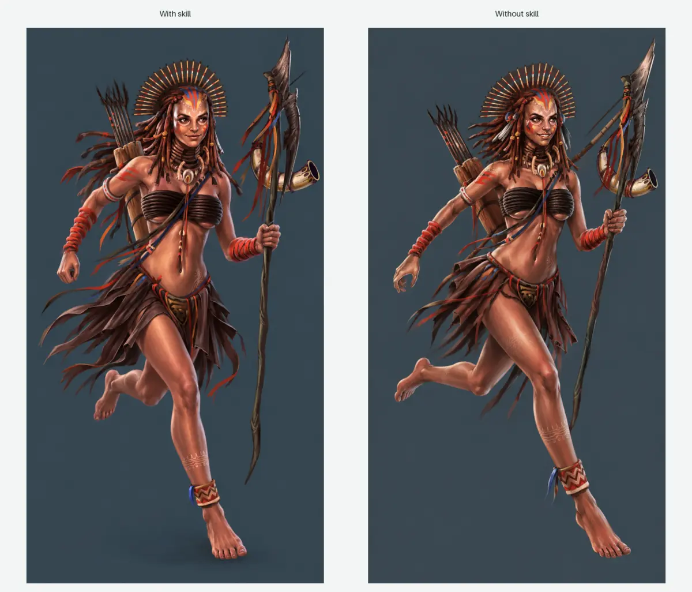
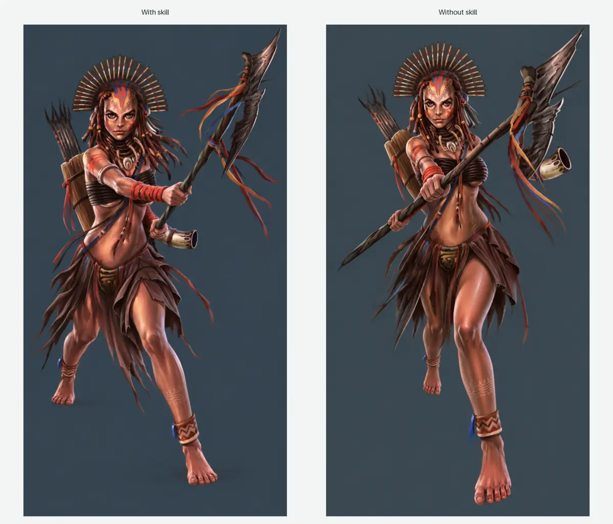
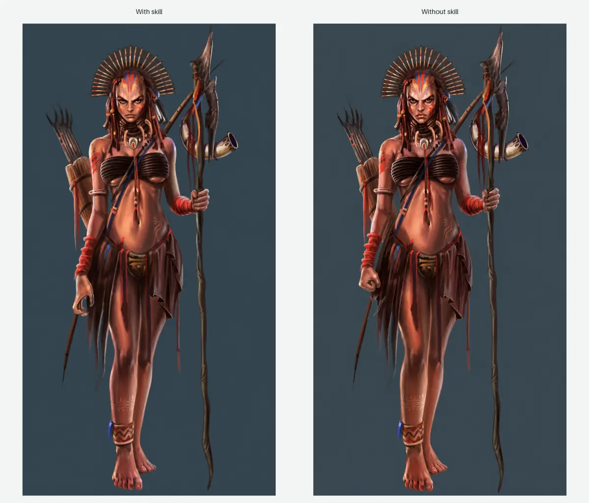

# Character Asset Studio

Character Asset Studio is a reusable ChatGPT and Codex skill for producing consistent character assets, pose and expression variants, multi-character scenes, equipment, clothing, vehicles, sprites, and mascots.

It adds a structured production workflow around image generation: identity and style locks, palette extraction, physical behavior, professional game-art direction, camera planning, equipment choreography, quality checks, and resumable project state.

> **Distribution status:** the skill is complete and usable by developers today. A skills-only ChatGPT plugin is the next packaging step. The plugin will provide the user-friendly installation route while keeping the skill itself unchanged.

## Install in ChatGPT

### One-click plugin installation

**Coming with the skills-only plugin release.** The public **Install in ChatGPT** link will be added here after the plugin package is published and its installation route is available.

The plugin will:

- install the existing `character-asset-studio` skill without changing its workflow;
- make the skill available from ChatGPT's plugin and skill interface;
- run with each user's own ChatGPT account and image-generation access;
- allow users to receive future skill updates through the plugin package.

Until that release, use the developer installation below.

## Manual download for developers

[Download the latest repository ZIP](https://github.com/mpMohAn/character-asset-studio-skill/archive/refs/heads/main.zip) or clone it:

```bash
git clone https://github.com/mpMohAn/character-asset-studio-skill.git
cd character-asset-studio-skill
```

Install the skill for your user:

```bash
mkdir -p "$HOME/.agents/skills"
cp -R character-asset-studio "$HOME/.agents/skills/character-asset-studio"
```

Or install it only for one repository:

```bash
mkdir -p .agents/skills
cp -R /path/to/character-asset-studio-skill/character-asset-studio \
  .agents/skills/character-asset-studio
```

Then ask ChatGPT or Codex to use `@character-asset-studio`. In interfaces that use dollar-prefixed skill names, use `$character-asset-studio`.

## Example prompts

### Single-character variants

```text
Use @character-asset-studio with this reference image. Create four actions—running,
jumping, attacking, and defending—and four expressions—happy, angry, surprised,
and focused. Preserve the face, silhouette, palette, clothing, and equipment.
```

### Skill-versus-normal comparison

```text
Use @character-asset-studio to create a happy running version of this character.
Also create the same request without the skill. Show both images side by side and
include a comparison table for identity, palette, equipment, pose, and physics.
```

### Multi-character scene

```text
Use @character-asset-studio to combine these selected characters in a deadly
warzone. Build the scene step by step, place the characters one at a time, make
their eye lines and actions respond to one another, and make one leader stand out.
Preserve each character's original visual style.
```

### Professional game-art direction

```text
Use @character-asset-studio to stage these two characters fighting each other.
Identify how their equipment should be used, choreograph a readable exchange,
choose a cinematic lens and focal length, and preserve their faces, costumes,
weapons, proportions, and source rendering style.
```

### Resume a larger job

```text
Use @character-asset-studio to continue this character project from its saved
manifest. Report what is complete, what failed validation, and the next smallest
generation batch required to finish it.
```

## Skill versus normal generation

The left side of each sheet was generated with Character Asset Studio's identity, equipment, palette, and motion constraints. The right side used a direct image request without the skill. These examples are representative tests, not guarantees of identical results on every generation.

### Happy running action



### Neutral attack action



### Angry idle expression



## Supported features

| Area | Support |
|---|---|
| Character consistency | Identity, silhouette, proportions, face, costume, and recurring-detail locks |
| Color | Palette extraction, semantic color roles, tolerances, and palette validation |
| Poses and expressions | Presets, custom actions, custom expressions, and action/expression validation |
| Motion and physics | Mass, gravity, balance, inertia, wind, cloth, hair, and secondary-motion planning |
| Equipment | Equipment identification, hand assignment, grip logic, contact, collision, and functional use |
| Camera | Lens intent, focal length, framing, angle, depth of field, motion treatment, and perspective checks |
| Art direction | Professional game-art composition, focal hierarchy, eye-line coordination, scene readability, and style preservation |
| Multiple characters | Cast scenes, character-by-character placement, interaction planning, montages, and selected-trait fusion |
| Production | Transparent masters, variants, contact sheets, sprites, normalization, manifests, and delivery packaging |
| Reliability | Validation gates, regional repair, retry logic, checkpoints, resumable jobs, and structured failure reports |

## Limitations

- Image generation is probabilistic. The skill improves consistency but cannot guarantee pixel-identical faces, hands, clothing, or equipment across every result.
- Exact animation-ready control requires a layered 2D rig, vector artwork, or a 3D model. A flat PNG alone cannot provide independent bone, hand, leg, or facial controls.
- Transparent edges, small accessories, complex grips, and overlapping weapons may need a focused repair or cleanup pass.
- Large casts may require staged generation because image tools limit how many references can be used effectively in one pass.
- Fusion can combine selected traits, but it should not be used as a shortcut when the user needs several distinct characters to remain separately identifiable.
- Results depend on the available image model, reference quality, resolution, and the user's generation quota or plan.
- The one-click ChatGPT plugin installer is not published yet. Manual installation is currently intended for developer workflows.

## Repository structure

```text
character-asset-studio-skill/
├── README.md
├── docs/images/                 # Public comparison screenshots
└── character-asset-studio/      # Installable skill (kept unchanged)
    ├── SKILL.md
    ├── agents/openai.yaml
    ├── assets/
    ├── references/
    ├── scripts/
    └── tests/
```

The planned plugin will wrap the `character-asset-studio/` folder as its skills-only installation payload. User documentation and screenshots stay at the repository root so they do not add unnecessary context to the skill itself.

## Version and updates

**Current documentation version:** `0.2.0-pre`  
**Status:** pre-release skill; plugin packaging pending

| Version | Update |
|---|---|
| `0.2.0-pre` | Added professional game-art direction, camera and lens planning, equipment choreography, multi-character scenes, montage and fusion modes, palette/physics controls, and resumable workflows |
| `0.1.0` | Initial consistent character-asset workflow, reference intake, asset specification, generation, and quality checks |

Developers can update a cloned copy with:

```bash
git pull origin main
cp -R character-asset-studio "$HOME/.agents/skills/character-asset-studio"
```

After the ChatGPT plugin is published, plugin users will receive the skill through that installation package instead of copying the folder manually. Release notes and the current installation route will remain in this README.

## Plugin packaging roadmap

- [x] Complete and validate the reusable skill folder
- [x] Add user-facing examples, comparison screenshots, features, limitations, and update information
- [ ] Convert the repository into a skills-only ChatGPT plugin package
- [ ] Publish and add the **Install in ChatGPT** route
- [ ] Add tagged releases and plugin update notes
